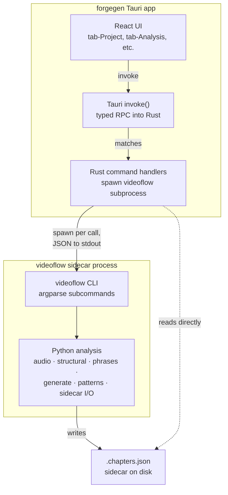

# Tauri ↔ videoflow bridge

forgegen (Tauri+React) is the UI; videoflow (Python) is the analysis backbone. They live in two languages, two processes, two binaries. This doc says how they talk.

## The decision

**v0: Tauri spawns the `videoflow` CLI per command.** Each Tauri command invokes `videoflow <subcommand> <args>` as a child process, parses JSON from stdout, returns it to React.

The user picked this over PyO3 (in-process) and FastAPI (local HTTP) because it's:

- **Fastest to scaffold** — videoflow's CLI already exists with the subcommands forgegen needs (`analyze-beats`, `auto-chapter`, `generate-funscript`, `patterns-list`)
- **Language-clean** — no Rust↔Python compile coupling; videoflow stays pure Python
- **Distribution-clean** — videoflow ships as a one-file PyInstaller binary inside the Tauri bundle (`tauri.conf.json` `bundle.externalBin`)
- **Debuggable** — every Tauri call is a CLI invocation you can reproduce in a terminal

Cost: ~150ms cold start per invocation. Fine for user-initiated work (Project file load, Analysis run, Generate run, Export). Not fine for real-time streaming — see v1 upgrade below.

## The CLI surface (already exists in videoflow 0.0.5-alpha)

| Tauri call | videoflow invocation | Returns |
|---|---|---|
| `analyzeMedia(path)` | `videoflow analyze-beats <path>` | beat map + duration |
| `autoChapter(path)` | `videoflow auto-chapter <path>` | chapter list (writes `<stem>.chapters.json` sidecar as side-effect) |
| `generateFunscript(path, opts)` | `videoflow generate-funscript <path> --style ... --density ...` | funscript JSON |
| `listPatterns()` | `videoflow patterns-list` | pattern catalog (CATALOG + CONSUMERS) |
| `readSidecar(path)` | (Tauri reads `<stem>.chapters.json` directly via fs) | sidecar dict |

All commands emit JSON to stdout by default. `--human` flag (top-level, before subcommand) toggles a terminal-friendly format — only the JSON path matters for Tauri.

Errors: non-zero exit code + JSON error object on stderr.

## v0 architecture diagram



## v0 Tauri-side scaffold

In Rust (`src-tauri/src/commands.rs`):

```rust
use tauri::api::process::{Command, CommandEvent};

#[tauri::command]
async fn analyze_media(path: String) -> Result<serde_json::Value, String> {
    let (mut rx, _child) = Command::new_sidecar("videoflow")
        .map_err(|e| e.to_string())?
        .args(["analyze-beats", &path, "--beats"])
        .spawn()
        .map_err(|e| e.to_string())?;

    let mut stdout = String::new();
    while let Some(event) = rx.recv().await {
        match event {
            CommandEvent::Stdout(line) => stdout.push_str(&line),
            CommandEvent::Stderr(line) => eprintln!("videoflow stderr: {}", line),
            CommandEvent::Terminated(payload) => {
                if payload.code != Some(0) {
                    return Err(format!("videoflow exit {}", payload.code.unwrap_or(-1)));
                }
                break;
            }
            _ => {}
        }
    }
    serde_json::from_str(&stdout).map_err(|e| e.to_string())
}
```

In React (`src/api/videoflow.ts` — or `.js`):

```js
import { invoke } from '@tauri-apps/api/tauri';

export async function analyzeMedia(path) {
  return invoke('analyze_media', { path });
}

export async function listPatterns() {
  return invoke('list_patterns');  // calls `videoflow patterns-list`
}
```

In `tauri.conf.json`:

```json
{
  "tauri": {
    "bundle": {
      "externalBin": ["binaries/videoflow"]
    },
    "allowlist": {
      "shell": {
        "sidecar": true,
        "scope": [
          { "name": "binaries/videoflow", "sidecar": true, "args": true }
        ]
      }
    }
  }
}
```

videoflow gets PyInstaller-bundled and dropped into `src-tauri/binaries/videoflow{-x86_64-pc-windows-msvc.exe,...}` per Tauri's platform-suffix convention.

## Long-running operations — progress events

videoflow already has a `progress` module emitting structured events (per the git log: `feat(progress): structured progress events with tree + ETA`). These are JSON lines on stderr (or a dedicated channel — verify before wiring).

For long calls (auto-chapter on a 90-min file can take minutes), Tauri streams progress events back to React via `tauri::Window::emit()`:

```rust
#[tauri::command]
async fn auto_chapter(window: tauri::Window, path: String) -> Result<serde_json::Value, String> {
    let (mut rx, _) = Command::new_sidecar("videoflow")?
        .args(["auto-chapter", &path, "--progress-json"])
        .spawn()?;

    let mut result = String::new();
    while let Some(event) = rx.recv().await {
        match event {
            CommandEvent::Stderr(line) if is_progress_event(&line) => {
                window.emit("videoflow:progress", line).ok();
            }
            CommandEvent::Stdout(line) => result.push_str(&line),
            CommandEvent::Terminated(_) => break,
            _ => {}
        }
    }
    serde_json::from_str(&result).map_err(|e| e.to_string())
}
```

React subscribes:

```js
import { listen } from '@tauri-apps/api/event';
listen('videoflow:progress', (event) => {
  // event.payload = { stage: 'beats', percent: 42, eta_s: 18 }
});
```

## Cold-start cost

PyInstaller-frozen Python takes ~100-200ms to spin up before the script runs. That's per-call overhead.

- Project tab — file picker → `analyze-beats` (one call, latency invisible in user flow) ✓
- Analysis tab — read sidecar (no spawn, just fs read) ✓
- Generate tab — `generate-funscript` once per chapter (multi-call; latency adds up) 🟡
- Live preview while scrubbing sliders — 🔴 per-call spawn would be too slow

When the live-preview cost becomes real (probably forgegen v0.3+), upgrade to v1.

## v1 — persistent-process upgrade (when needed, not now)

Switch to a `videoflow ipc` subcommand that opens a JSON-RPC loop on stdio. Tauri spawns it once at app start, reuses the same subprocess for all calls. Cold start happens once (~150ms); subsequent calls are sub-millisecond.

Protocol: JSON-RPC 2.0 over stdio. One JSON object per line.

```
→ {"jsonrpc":"2.0","id":1,"method":"analyze-beats","params":{"path":"foo.mp4"}}
← {"jsonrpc":"2.0","id":1,"result":{"bpm":128.0,"beats":[...]}}
```

Implementation sketch:

```python
# videoflow/src/videoflow/ipc.py (new module, v1)
def cmd_ipc(args):
    for line in sys.stdin:
        try:
            req = json.loads(line)
            method = METHODS[req["method"]]
            result = method(**req.get("params", {}))
            print(json.dumps({"jsonrpc": "2.0", "id": req["id"], "result": result}))
        except Exception as exc:
            print(json.dumps({"jsonrpc": "2.0", "id": req.get("id"), "error": {"code": -1, "message": str(exc)}}))
        sys.stdout.flush()
    return 0
```

Migration is transparent to React — the `invoke('analyze_media', ...)` API stays the same; only the Rust handler changes from "spawn per call" to "send to long-lived child."

Defer until forgegen Generate's live preview demands sub-100ms latency.

## Distribution

videoflow gets PyInstaller-frozen for each target platform:

```bash
# CI / local
pyinstaller --onefile videoflow/src/videoflow/cli.py --name videoflow
mv dist/videoflow forgegen/src-tauri/binaries/videoflow-x86_64-pc-windows-msvc.exe
```

Tauri's `externalBin` config picks it up at bundle time. End-user runs forgegen and it Just Works™ — no separate Python install needed.

The PyInstaller bundle is fat (~80-150MB with librosa + numpy + scipy). One-time download cost — not a per-launch cost. Acceptable for a desktop studio app.

## Out of scope (v0)

- **Tauri-to-Tauri sub-app messaging** (e.g., forgegen launching FFP) — separate concern; addendum §4 master-clock contract covers cross-app sync at the time-signal level
- **Concurrent videoflow calls** — v0 assumes one analysis at a time; serialise in the React layer or block at the Rust layer
- **Cancellation** — v0 lets calls run to completion. Long-running operations (auto-chapter) need `kill_on_drop` or explicit cancel signal. Add when needed.
- **Streaming generation** for ForgeStream — that's the v1 persistent-process model anyway; ForgeStream will need it before forgegen does

## Cross-references

- `forge-ui-design/ARCHITECTURE_ADDENDUM_2026_05.md` §1 — Tauri+React stack decision
- `forgegen/REFACTOR_TO_TAURI_REACT.md` — what forgegen builds on top of this bridge
- `videoflow/SIDECAR_GAP_VS_ITER09.md` — sidecar contract videoflow honours on the other side of the bridge
- videoflow CLI source: `videoflow/src/videoflow/cli.py`
