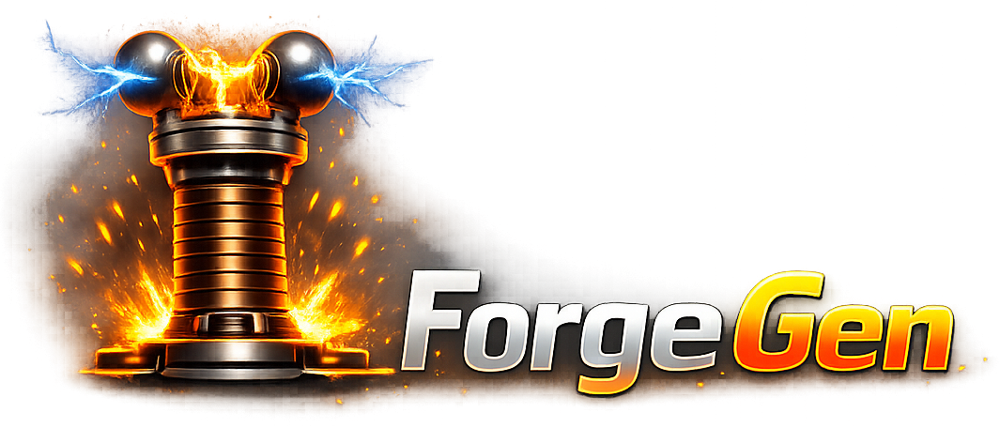

<p align="center">
  
</p>

# forgegen

**Audio and video to funscript — in seconds, not hours.**

forgegen is a haptic content generation engine. Drop in a music track or video file. forgegen analyses the rhythm, phrase structure, and energy, then outputs a `.funscript` file ready to drive any haptic device.

[Quick Start](quick-start.md){ .md-button .md-button--primary }
[Using the UI](ui/index.md){ .md-button }
[CLI Reference](cli/index.md){ .md-button }

---

## Who is this for?

### Content scripters

You produce funscripts for an audience — posting to EroScripts, selling on Patreon, scripting for video libraries. A 10-minute video takes 2–8 hours to script by hand. forgegen gives you a quality starting point in under a minute, leaving your time for the refinement that makes a script yours.

### Music and EDM creators

You want haptic tracks synced to music — club nights, VR experiences, haptic-enabled music videos. forgegen handles the complete audio-to-haptics pipeline. No video required. No scripting tools. Drop a song, generate, play.

### The estim community

Stereo audio-driven estim is a niche workflow with no good tools. forgegen's estim audio path treats stereo stim audio as a first-class input — two channels, two curves, clean export. *(Coming in v0.2)*

### FunScriptForge users who want a starting point

Manual scripting from scratch is slow. Starting from a generated draft is fast. forgegen feeds FunScriptForge a clean, structured `.funscript` that you then refine, tone-shape, and export per device. The generation handles the tedious work; you focus on what makes it feel good.

### Pipeline builders and studios

You produce content at scale — multiple tracks or videos per week. Because forgegen ships a full CLI and importable Python library, it fits into automated watch-folder pipelines, CI/CD workflows, and batch processing scripts. Generate an entire back-catalog overnight.

---

## Why does it exist?

The existing toolchain is fragmented:

| Tool | Problem |
| --- | --- |
| OpenFunscripter | Manual editing only — doesn't generate from media |
| PythonDancer | Basic beat-locking — mechanical output, no phrase shaping |
| FunGen | AI-assisted but VR-only — doesn't work on flat video or audio |
| FunscriptFlow | Generic pipeline — no user interface, requires coding |
| funscript.io | Micro-tools — Handy-specific, no offline use |

No tool generates quality funscripts from arbitrary audio or video, handles phrase-level shaping, runs locally without a cloud API, and hands off cleanly to an editing tool.

forgegen is that tool.

---

## How it works

> **forgegen reads the structure of the audio and generates against that structure — not against an undifferentiated stream.**

That's the difference between forgegen and every other audio→funscript tool. A 90-minute video opens with ambient pacing, builds through tension, peaks, and cools down. Whole-file analysis flattens that — the loud climax dominates the energy distribution, the quiet sections get crushed, and the resulting funscript is either music-only-good or motionless. forgegen detects the natural sections of the audio first, then runs the analysis once per section, so each section's pacing is preserved in the output.

```text
Media file → Audio structure → Per-section beat & energy → Per-section classification → Curve shaping → .funscript
```

1. **Structure** — forgegen detects natural sections from silence, recurrence, and energy transitions in the audio (typically chapters of around 5–6 minutes). On a long-form video this is the difference between a usable funscript and a flat one. The detected chapters are written to a small sidecar JSON next to the source, so any other lqr tool reading the same file sees the same sections.
2. **Analyse** — forgegen detects the beat grid, BPM, phrase boundaries, and energy envelope. With chapters, this runs *per chapter* — energy normalises within each section's own range, so a quiet ambient passage isn't drowned out by a loud climax somewhere else in the file.
3. **Classify** — each phrase is labelled automatically: `break`, `tease`, `slow`, `steady`, `fast`, or `edging`, based on the phrase's energy, tempo, and trend *relative to its chapter's distribution*. A phrase that's average for its quiet ambient chapter classifies as `steady` — not crushed to `break` because its absolute energy is low.
4. **Shape** — the motion curve is sculpted per mode. A `tease` phrase has narrow amplitude. An `edging` phrase builds from 50% to full range. A `break` nearly stops the device. The curve feels written, not generated.
5. **Export** — a validated, sorted `.funscript` JSON is ready to load in FunScriptForge, SyncPlayer, or any compatible player.

The chapter sidecar is shared with the rest of the lqr toolchain. ForgePlayer uses the same chapters for navigation on videos that have no built-in chapter markers. ForgeAssembler uses them as suggested cut points. FunscriptForge overlays them as a second ruler track in the editor — when the audio's structure and the script's phrase analysis agree you've got a clean section to edit; when they diverge, you've got a teaching moment about the script. All four apps read and write the same `<stem>.chapters.json`; refining chapters in one tool flows through to the others.

---

## Where it fits

forgegen is the **generation** layer. FunScriptForge is the **editing** layer. Together they cover the full pipeline.

```text
forgegen  →  .funscript  →  FunScriptForge  →  any device
```

forgegen never edits funscripts. FunScriptForge never generates from scratch. They are independent tools with a clean handoff at the `.funscript` boundary.

See [forgegen + FunScriptForge](workflow/fsf-handoff.md) for the full workflow.

---

## Getting started

- [Quick Start](quick-start.md) — generate your first funscript in under a minute
- [Using the UI](ui/index.md) — full walkthrough of the Generate and Details tabs
- [CLI & Automation](cli/index.md) — run forgegen from the command line or integrate into a pipeline
- [Styles](reference/styles.md) — understand the four style presets
- [Phrase Modes](reference/modes.md) — understand how forgegen shapes each section of your track
